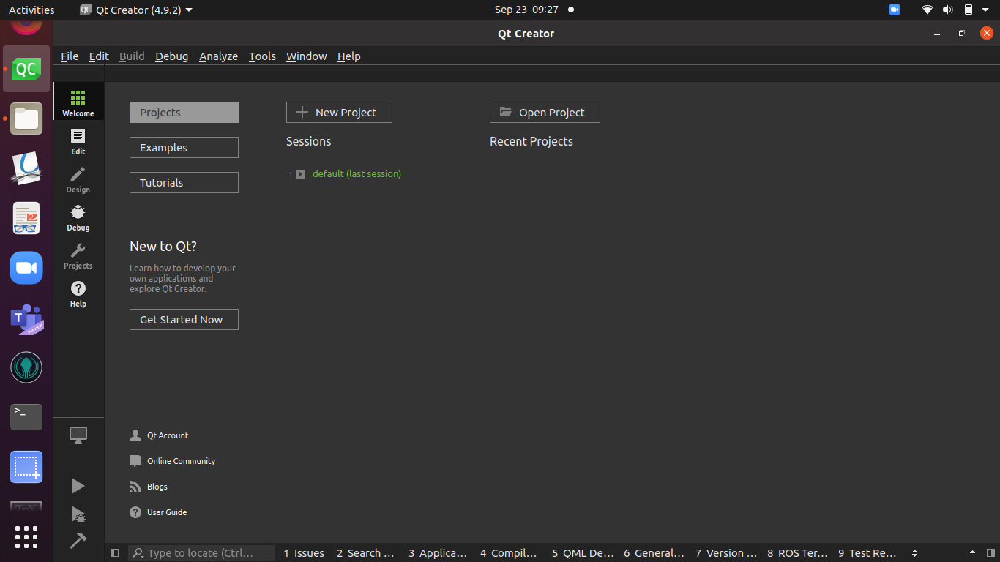
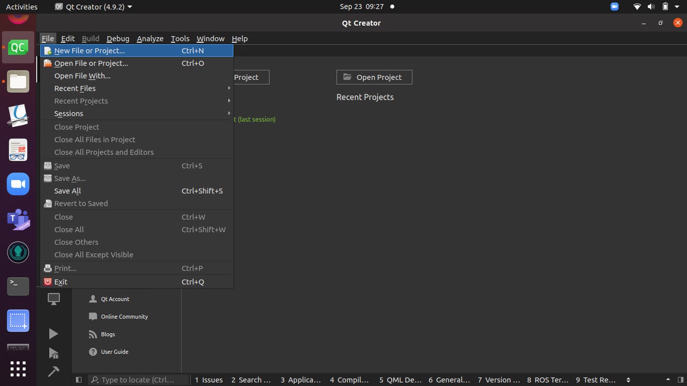
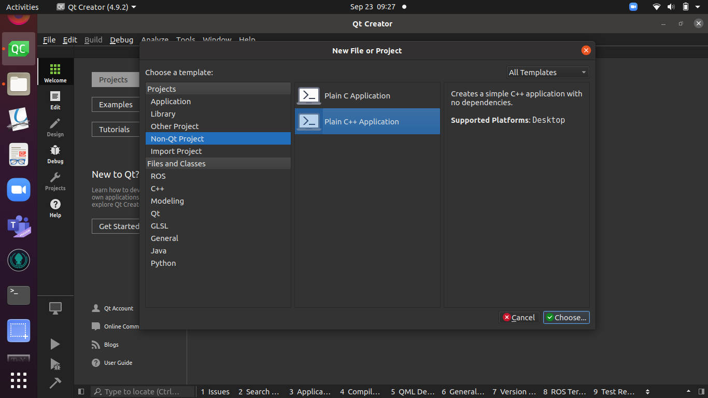
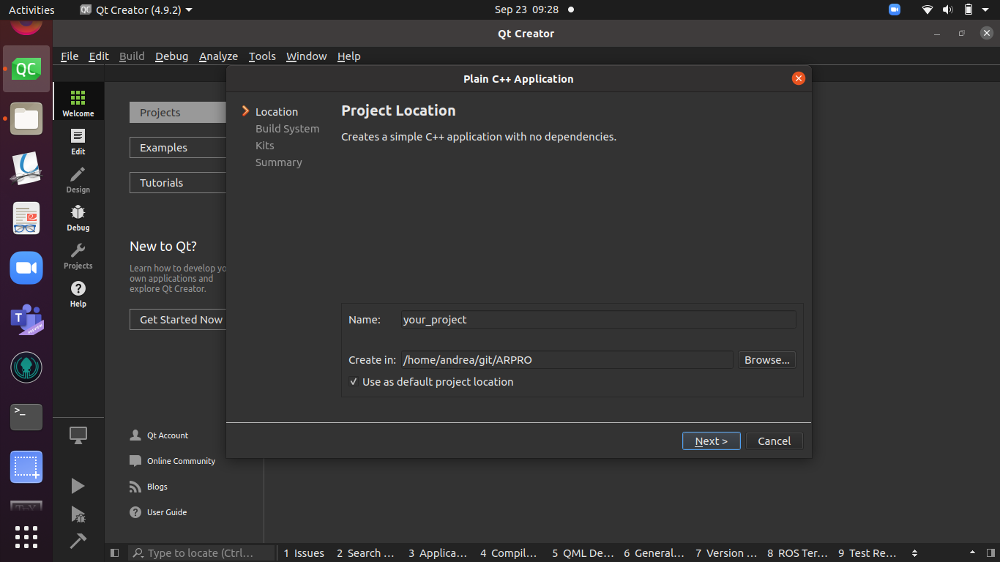
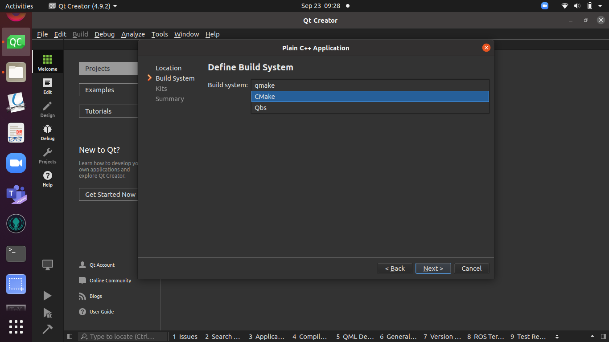
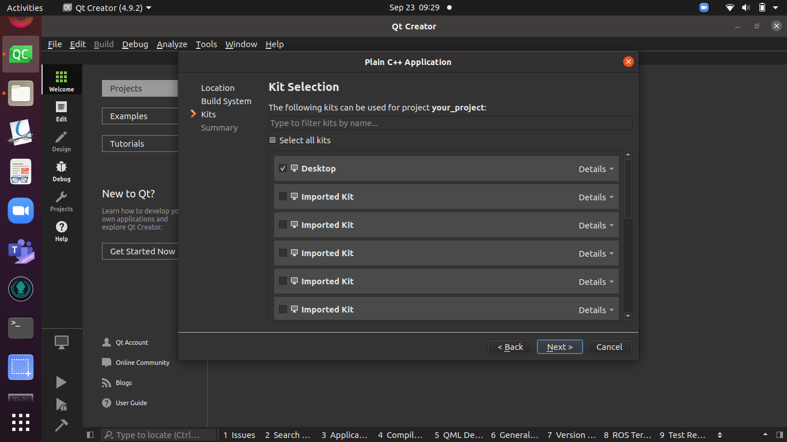
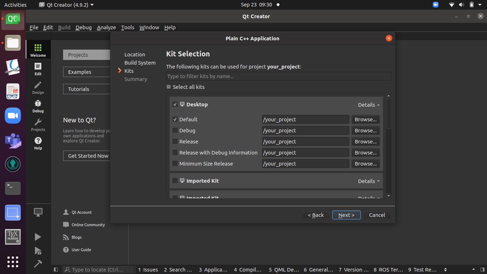
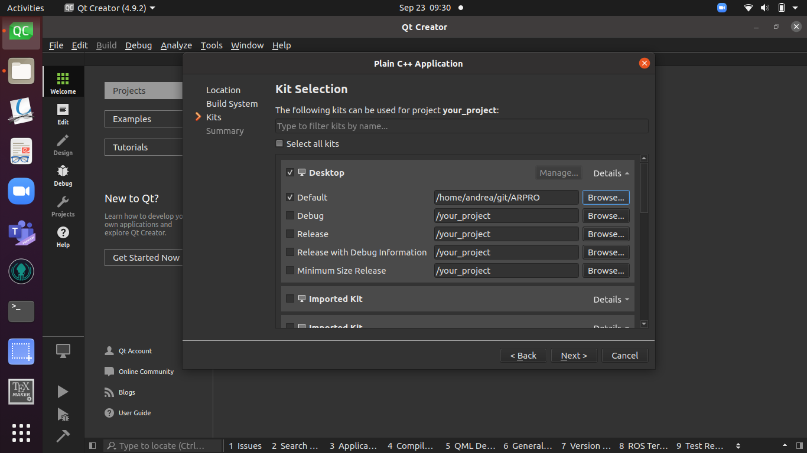
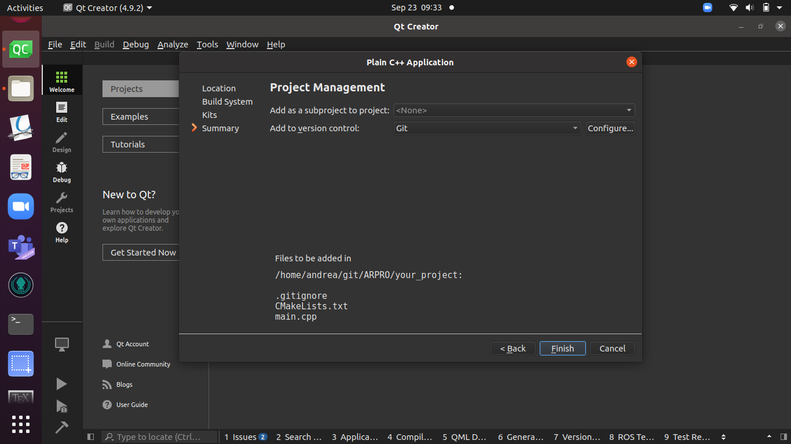
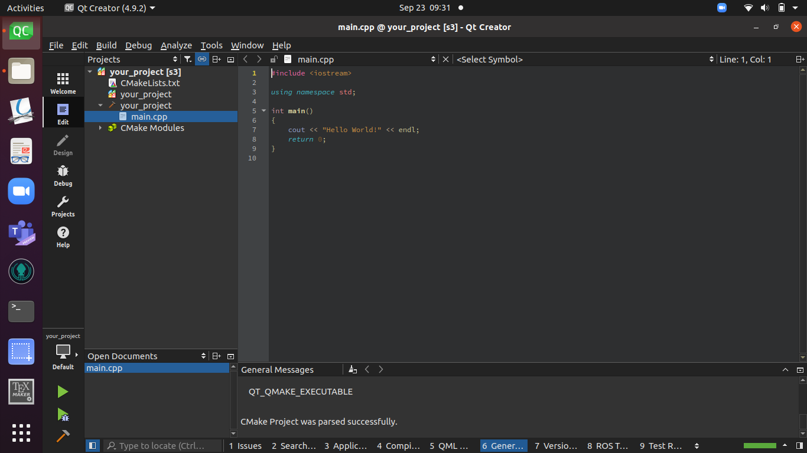

# ARPRO

In this branch there is a little tutorial on how to set up a new project from scratch using Qt Creator.

### Start Qt Creator
First, we need to start Qt Creator, you should be by default on the Welcome section. The sections are on the left, the first one is the welcome section with the 9 aligned squares.

### Create a new Project
Once there you need to select the file section and then "New File or Project", as shown in the image below.

Once selected the "New File or Project" a window will pop up, use it to create the specifications of your project.

First, you need to specify which kind of project you want to create. In our labs, we only use C++ so select the section ; "Non-Qt Project" and then "Plain C++ Application". You can then go to the next section.

### Place your project 

Name your project as you want. Here I used the name "your_project". Note that if you want to use more words you must space them with the underscore "_".
You then need to select where to put your project. Select a meaningful folder which you can also set as default. If you set the folder as default, the next time you won't have to select it again.

### Select your build system
It is now time to select the build system we use. In our labs, we only use the CMake command so you need to select it as shown in the image below.

Then, you can go on the next section.

### Select the proper kit
You know have to select the kit you'll use to build your project.
First make sure to check only the Desktop checkbox.

Then, click to details and make sure only the checkbox of Default is selected.

You know need to specify the location where the compiled and build files will be generated. Be careful in this choice. It is common practice to have, in your project folder, a sub-folder named "build" which contains all these files.

You may want to follow this suggestion, and you only need to click on the "Browse..." button on the right and select the same path as the one you choose when you [specified the location of your project](#proj_loc).

Now in order to have the generated files inside the sub-folder "build" add the following to the path of the Default build location

      /your_project/build

Where you replace "your_project" with the name you choose. The result should be similar to the one shown in the image below.

### End
You will now be prompt to the Summary section. Nothing to do here, your project is ready.

You can press on finish and have your project created.

Now that your project is done, if you go to the CMakeLists.txt file, you will notice some differences from the one we write during the lab. It is not a problem, Qt Creator generates some parameters that we actually do not need for the moment but will not do any harm in being there. 
